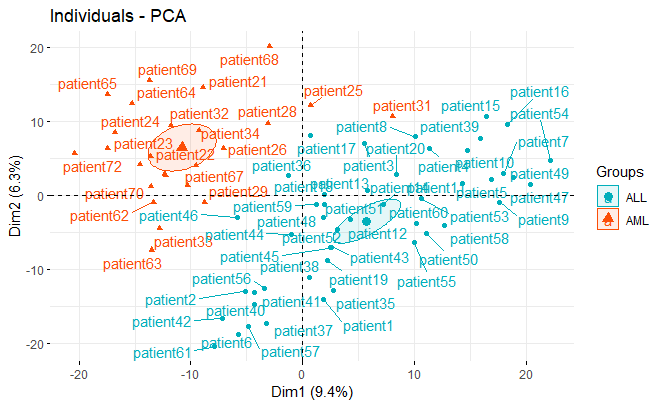

# Exploratory data analysis of the Leukemia gene expression

## Problem statement 
Researchers in genomics are frequently interested in understanding how their samples are related to one another and how different variables in the data set are correlated. They usually want to answer the following questions: Are our replicates similar to each other? Do the samples from the same treatment group have similar genome-wide signals? Do the patients with similar diseases have similar gene expression profiles?. From these informations, one can develop an hypothesis, identify outliers in the sample, or determine which sample groups require more data points. In this perspective, the project goal is to do an exploratory data analysis of the Leukemia gene expression to answer some scientists' questions. 

## Algorithms use to Approach the problem 
The clustering techniques(k-means, k-medoids, and hierarchical clustering) will be applied to find groups of patients that are more similar to each other than the rest of the patients using the distance or similarity metric between patients’ expression profiles. 

The dimension reduction technique (PCA, SVD) will be applied to  reduce the number of genes expression or variables to obtain  a few principal highly variables that capture most of the variations inside the data instead of thousands. This is useful for clustering, predictive modeling and 2D or 3D visualization of many genes expression.

# Data description
The leukemia dataset consists of gene expression profiles for 72 patients, 47 of who suffer from ALL and $57$ from AML leukemia type. This data comes from the landmark Science paper authored by [Golub and colleagues in 1999](https://hastie.su.domains/CASI_files/DATA/leukemia.html). It contains 7128 genes with no missing data.

## Experimental Procedure
The following steps were considered: 

* Ordered Dissimilarity Matrix (ODM) was used to assess clustering tendency in the dataset.

 * We then used the density plot visualization of the bivariate distribution for the first principal components to have a clearer vision of any clustering distribution within the gene expression of the patients. SVD is applied to plot samples on the reduced dimensions to visualize a clear separation of samples. 

* The hierarchical clustering was applied using complete, single, average, ward.D, and ward.D2 linkage to find the relationship between individual data points and clusters. We look at the highest separation between clusters to identify the appropriate level to cut the dendrogram. We obtain a collection of clusters at various levels of the dendrogram cutting point, and we utilize majority voting to choose the appropriate number of clusters.

* The partition clustering approach (k-means and k-medoids) was employed to find hidden groups within the patients gene expression. The average silhouette value for various k values has been applied to determine the appropriate number of clusters. The validation of cluster consistency within data clusters was endorsed using the within-cluster variation method known as the gap statistic.

## Result and Discussion 
[Report](https://github.com/B23579/Leukemia-data-analysis/blob/main/Baurice_Nafack_SLD.pdf)
## PCA
 
